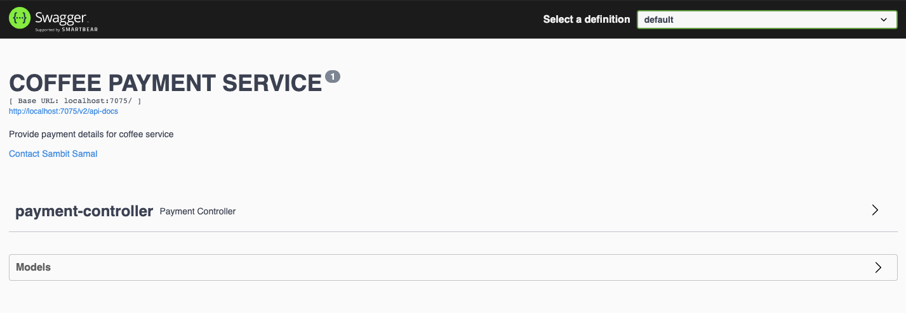
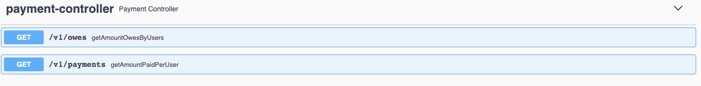

# Coffee Payment Service

## Description:
This service will provide following types of data.
- Amount paid per user.
- Amount that each user still owes.
- If no user provided then amount for all users.

## Source Data :
3 JSON files present in resource folder.

These files contain data for orders, products and payments.

### examples
- Orders data : `{
"user": "zoey",
"drink": "short espresso",
"size": "small"
}`
- Products data: `{
"drink_name": "latte",
"prices": { "small": 3.5, "medium": 4.0, "large": 4.5 }
}`
- Payments data: `{ "user": "coach", "amount": 27 }`

## Pre-requisite
- Java 11
- Maven 
- Git bash (Or any IDE from where you can connect to git)

## Steps to run the application
- Checkout the code / Download from git repo(https://github.com/sambit1007599/coffee-payment-service.git)
- checkout : open git bash and run command `git clone https://github.com/sambit1007599/coffee-payment-service.git`
- open command prompt(cmd)
- go inside the project folder
- run command `mvn clean install`
- once its successfully build run command `mvn spring-boot: run`

Now application is up and running

## How to use this service
- Open the URL in your browser : http://localhost:7075/swagger-ui/index.html
- You will see a swagger page with all the defined specs of the service. There will be 2 GET methods you can see.
- 

### 1. GET : /v1/owes
#### Description:
- This endpoint is to provide you data about amount that each user still owes. There are 2 options to fetch these data.
- - If you provide specific username, then it will show you the data of that particular user
  - If you don't provide any specific username, then it will show you the data of all the users.
- Click on GET -> Try it out -> give username(optional) -> Execute

### 2. GET : /v1/payments
#### Description:
- This endpoint is to provide you data about amount that each user paid. There are 2 options to fetch these data.
- - If you provide specific username, then it will show you the data of that particular user
  - If you don't provide any specific username, then it will show you the data of all the users.
- Click on GET -> Try it out -> give username(optional) -> Execute

